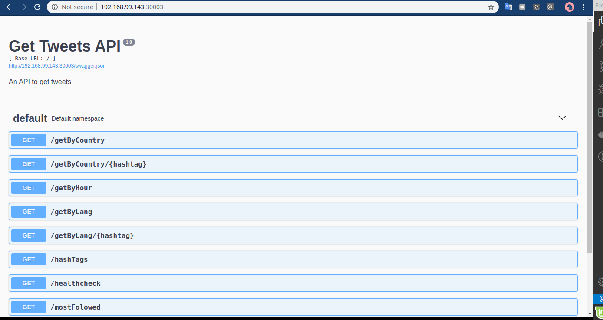
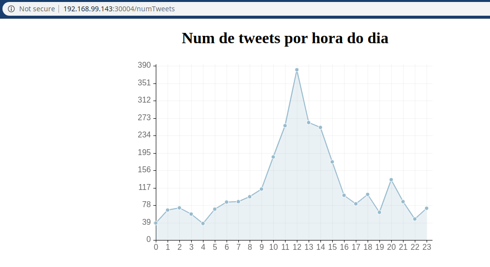
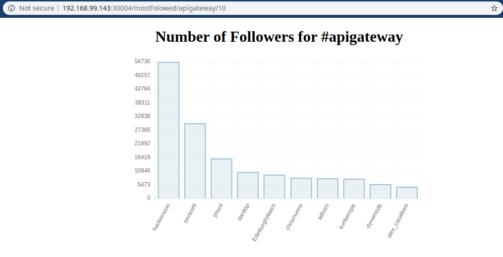
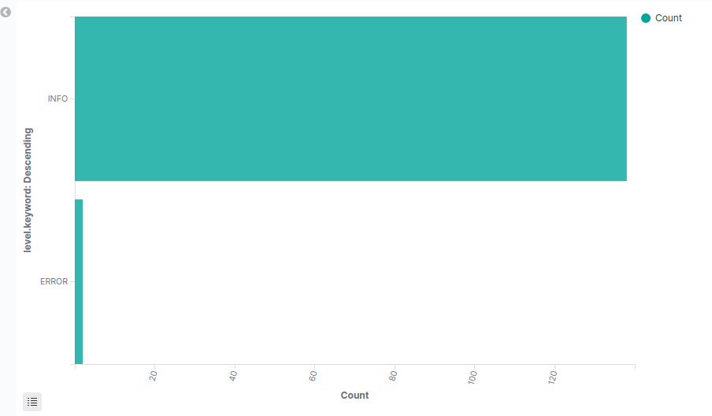
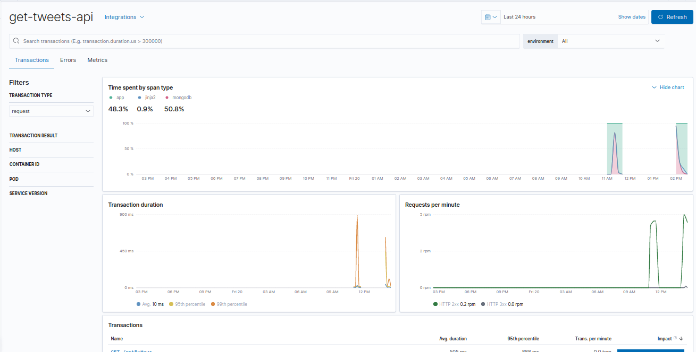
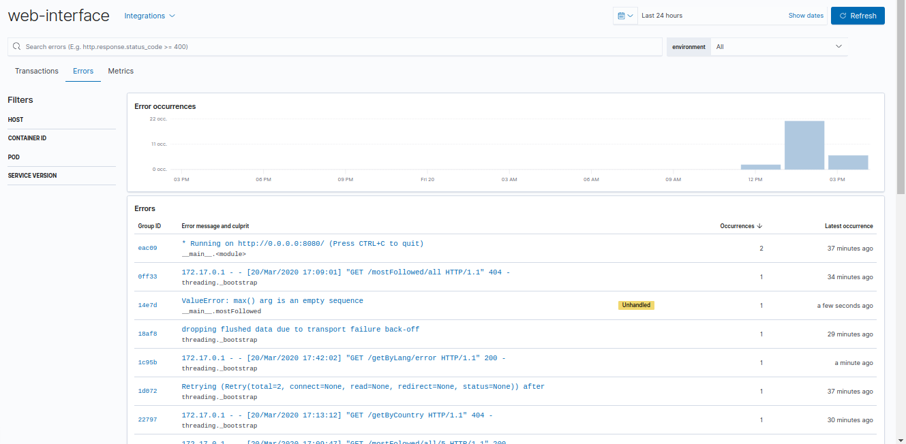
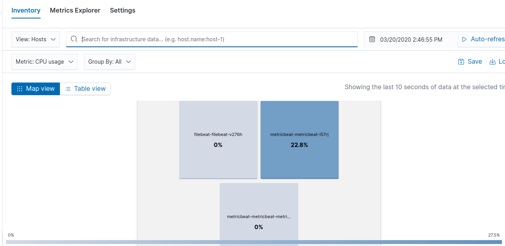
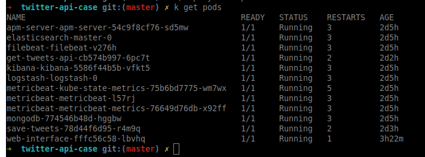

# Twitter API

Esse projeto mostra de maneira simplificada o funcionamento de um ecossistema de microsserviços. E contém principalmente 4 componentes:

* Uma aplicação python agendada para rodar de hora em hora que salva informações adquiridas com a API do twitter em um banco de dados não relacional (mongoDB);

* API REST para realizar consultas ao banco, desenvolvida em Flask;

* Interface Web para consumir esta API desenvolvida em FLask;

* Stack de monitoração, logging e APM (elastic) para acompanhar o desempenho do sistema desenvolvido.

 

Além disso, visando auto escalabilidade e facilidade no deploy, foram utilizadas as ferramentas Helm e Kubernetes.

## Requisitos

* Minikube: v1.1.9

* Kubernetes:  v1.15.4

* Docker: v18.09.7

* Helm: v2.14.2

* Python: v3.6.9

## Componentes

### save-tweets

Responsável por alimentar o banco de dados, esse componente é agendado para rodar de uma e uma hora consumindo determinadas **#hashtags**, listadas abaixo: "#openbanking", "#apifirst", "#devops", #cloudfirst", "#microservices", "#apigateway",  "#oauth", "#swagger", "#raml" e "#openapis". e salvando as seguintes informações de cada tweet:

* **user**: username do usuário;

* **followers**: Quantidade de seguidores do usuário;

* **date**: Data em que o tweet foi publicado;

* **language**: Língua em que o tweet foi publicado;

* **country**: Localização em que o tweet foi publicado;

#### Operação

Para rodar essa aplicação é necessário exportar como variável de ambiente a variável **PASSWORD**, à qual irá descriptografar as secrets e tokens da API do twitter.

#### Melhorias

* Colocar a variável PASSWORD como uma secret no kubernetes;

* Colocar o atributo salt da classe Crypt como um secret no kubernetes;

* Ler de um config map as hashtags pela qual o programa deve iterar;

* Modificar a maneira com o qual o logstash acessar os logs da aplicação;

* Adicionar autenticação ao acesso do mongoDB;

### get-tweets-api

Responsável por consumir as informações no banco de dados e export em forma de uma API RESTFUL. Como está API foi pensada apenas para consumir os dados dos banco, apenas o método GET está disponível. O swagger da aplicação está disponível no prefixo "/" da aplicação.

#### Operação

Para acessar a documentação completa dos métodos disponíveis da API, pode-se acessar o swagger, disponibilizado no prefixo ‘/’. Abaixo os métodos disponíveis.

 

* '/mostFolowed', '/mostFolowed/<topic>', '/mostFolowed/<int:number>', '/mostFolowed/<topic>/<int:number>': Método que retorna os usuários com mais seguidores, podemos filtrar por método e o número de usuários de retorno. 

* ‘/hashTags’: Retorna as hashtags cadastradas no banco;

* '/getByHour': Trás os número de publicações por hora do dia;

* '/getByLang', '/getByLang/<hashtag>': O número de publicações por língua, pode-se filtrar pela hashtag;

* '/getByCountry', '/getByCountry/<hashtag>': O número de publicações por localização, pode-se filtrar pela hashtag;

* '/healthcheck': Retorna ok 200;

* '/' - swagger da aplicação;

#### Melhorias

* Adicionar API-KEY;

* Fazer com que o healthcheck realize testes nos metodos;

### web-interface

A interface web desenvolvida trás de uma melhor forma os dados expostos pela API. Abaixo as páginas disponíveis.

* **$(minikube ip)/numTweets:** Retorna um gráfico de linha com o número de tweets salvos pela hora de criação, salvos no banco de dados.

* **$(minikube ip)/mostFolowed/<hashtag>/<int:number>:** retorna um gráfico de barra com a quantidade de seguidores, dos seguidores mais seguidos, é possível filtrar por hashtag e o número de resultados.

* **$(minikube ip)/getByCountry/<hashtag>:** Retorna uma tabela com o número de tweets por localização. É possível filtrar pela hashtag. 

* **$(minikube ip)/getByLang/<hashtag>:** Retorna uma tabela com o número de tweets por língua. É possível filtrar pela hashtag. 

### Logging:

Enviando os logs das aplicações para o logstash e salvando no elasticsearch, podemos fazer algumas consultas no kibana e montar gráficos, informando sobre a saúde da aplicação. 

#### Stream de logs:

#### Charts:

**Quantidade de cada level de log:**

**Quantidade de logs por pod:**

### Métricas

#### APM:

**Transações das aplicações:**

**Erros:**

**Métricas:**

### Metricbeats:

**Visão por pod:**

**Metricas:**

### Deploy:

Para fazer o deploy de toda infraestrutura e aplicações um script foi criado chamado de deploy.sh. Uso: ./deploy.sh [OPÇÕES]:

* -a    Realiza deploy de todas release

* -i    Realiza deploy das releases de ferramentas

* -u    Realiza deploy das releases das aplicações

* -p    OBRIGATÓRIO: passord para realizar deploy da aplicação save-tweets

* -h    Exibe ajuda.

Esse script realiza helm upgrade ou helm delete das aplicações. Além disso auxilia a passar a senha necessária para a aplicação de coleta de tweets funcionar. para um deploy te toda aplicação, após iniciar o minikube, e setar o tiller do helm com o comando (helm init --upgrade). Executar o script: ./deploy -p "PASSWORD" -a.

Para obter o ip do minikube: $ minikube ip

**Endpoints**: 

* $(minikube ip):3002 - Kibana

* $(minikube ip):3003 - API

* $(minikube ip):3004 - Interface Web

DockerHub com as imagens:

[https://hub.docker.com/repository/docker/leonardomontero/twitter-api-case](https://hub.docker.com/repository/docker/leonardomontero/twitter-api-case)

**Leonardo‌ ‌Torres‌ ‌Montero‌ ‌**
DevOps‌ ‌-‌ ‌ltmleo@hotmail.com‌ ‌